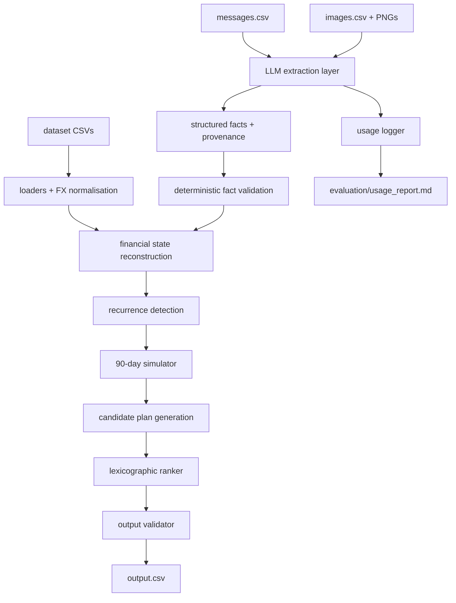
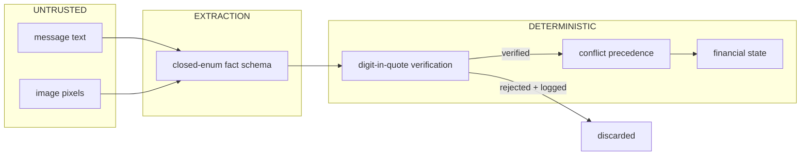
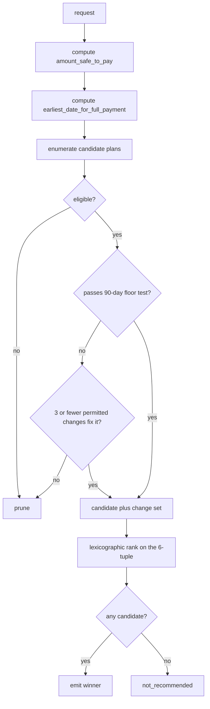
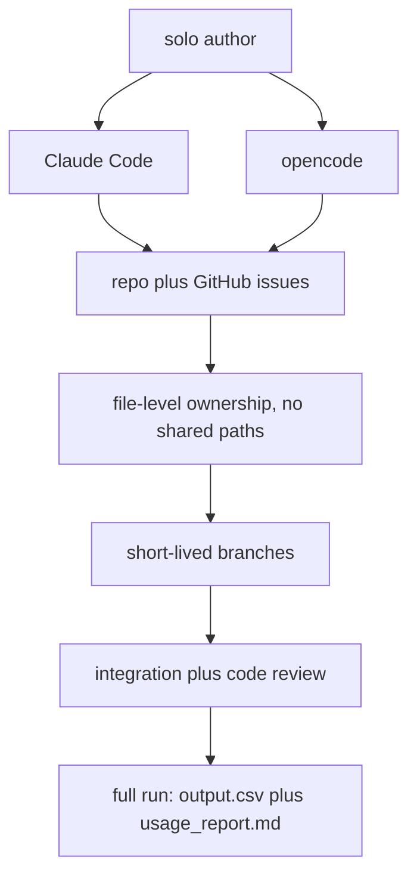

# CONTEXT.md — Buy or Wait? (HackerRank Orchestrate, Sept 2026)

Phase 1 domain brief. Evidence-backed; every claim below was verified against the actual dataset,
not inferred from the README.

> Scope note: the `domain-modeling` skill treats `CONTEXT.md` as a pure glossary. This file is
> deliberately broader (a Phase-1 brief) because that was explicitly specified. Implementation
> detail still belongs in the spec, not here.

---

## 1. Challenge understanding

For each of the 250 rows in `dataset/requests.csv`, decide whether the user should pay in full,
pay partially, use installments, wait, or not proceed — and write one row to root `output.csv`.

A recommendation is **safe** only if every payment in the plan can be made, the request completes
by `desired_completion_date`, essential spending is covered, and the projected balance never drops
below `minimum_balance_to_keep` across a 90-day forecast.

Graded on: `amount_safe_to_pay` accuracy, `affordability_status`, `recommended_payment_method` +
`payment_plan`, `earliest_date_for_full_payment`, `spending_changes_needed` validity, and the
usefulness/consistency of `decision_explanation`.

Deliverables: `code.zip` (incl. `evaluation/usage_report.md` for the final full run), `output.csv`,
and `log.txt` as the chat transcript.

---

## 2. Dataset / data model — verified facts

| File | Rows | Verified facts |
|---|---|---|
| `requests.csv` | 250 | `request_date` spans 2023-01-20 … 2026-09-04. **One request per user**, no reuse. `allows_partial_payment`: 170 false / 80 true. 9 request types, ~28 each. |
| `sample_requests.csv` | 25 | Users `user_01`…`user_25`. **Disjoint from the 250 evaluation users** — zero leakage, pure format/behaviour guide. |
| `financial_profiles.csv` | 275 | = 250 eval + 25 sample users. Currencies: INR 67, EUR 62, IDR 55, ZAR 51, USD 40. |
| `financial_events.csv` | 25,342 | 56–129 events per user. |
| `exchange_rates.csv` | 134 | 39 distinct dates. Only 5 directed pairs: USD→INR, USD→IDR, USD→EUR, EUR→USD, EUR→ZAR. |
| `request_payment_options.csv` | 790 | 2–4 options per request. **Only `full_payment` and `installments` exist** — never `partial_payment`. Exactly one `full_payment` option per request (275 total). |
| `messages.csv` | 215 | Exactly **one message per user**, for 215 of 275 users. Valid UTF-8; 60 contain smart quotes/en-dashes. |
| `images.csv` | 16 | **Exactly the 16 blank-amount events, 1:1.** All 16 PNGs present on disk. |

### Controlled vocabularies (exhaustive, from the data)

- `event_type`: `expense` 20525, `subscription` 2488, `income` 1696, `debt_payment` 567,
  `investment_purchase` 29, `refund` 22, `investment_valuation` 10, `investment_sale` 5
- `status`: `settled` 25148, `pending` 71, `scheduled` 70, `cancelled` 22, `failed` 21, `unrealized` 10
- `direction`: `debit` 23609, `credit` 1723, `non_cash` 10
- `flexibility`: `fixed` 21138, `reducible` 2682, `stoppable` 1297, `reducible_or_stoppable` 225
- `payment_methods_user_will_consider`: 7 observed combinations of the 3 methods
- Protectable categories: rent, groceries, transport, utilities, education, debt_repayment, insurance, healthcare, housing, family_support
- Reducible categories: dining, shopping, streaming, entertainment, gym
- Stoppable categories: cloud_storage, streaming, music_subscription, delivery_membership, gym

### Hard structural invariants discovered

1. **`minimum_allowed_amount` is populated exactly when `flexibility ∈ {reducible, reducible_or_stoppable}`** — perfect correlation, 2907/2907. It is the floor for `reduce_to`.
2. **`max_installment_months` is blank exactly when `installments ∉ payment_methods_user_will_consider`** — 119 blank/absent, 156 set/present, zero off-diagonal.
3. **FX coverage is complete**: all 140 foreign-currency events have an exact rate row for both their `settlement_date` and their `event_date`. 139/140 are credits. No missing-rate fallback is needed.

---

## 3. Financial-state model — what affects available cash, and when

`current_available_balance` is the balance **as of `request_date`**; all `settled` history up to that
date is already baked in. The forecast therefore starts from that number and only applies events
dated after `request_date`.

| Record | Counts toward cash? | When |
|---|---|---|
| `settled` (any direction) on or before `request_date` | No — already in the balance | — |
| `pending` **debit** | **Yes, reserve it** | `settlement_date` |
| `pending` **credit** (refunds, bonuses, commissions, lottery, investment gains) | **No** — never count until settled | — |
| `scheduled` **debit** (incl. failed-payment retries) | **Yes** | `settlement_date` |
| `scheduled` **credit** (`Next confirmed salary`) | **Yes** | `settlement_date` |
| `cancelled` | No | — |
| `failed` | No (but see lifecycle: the retry child counts) | — |
| `unrealized` / `non_cash` `investment_valuation` | **No** — not available cash | — |
| `settled` `investment_sale` (realized) | Yes | `settlement_date` |
| Row whose description marks it a **duplicate** | **Yes, reserve it** — see D9 | `settlement_date` |

Foreign-currency events convert at the rate row for **(settlement_date, from_currency, home_currency)**.

---

## 4. Recurrence rules

Recurrence must be **inferred** — the dataset contains only history plus a single explicit
`Next confirmed salary` row. Sample forensics prove inferred recurrence is required: for every
uncapped sample, the implied reserve far exceeds the sum of explicit future events
(e.g. `request_22`: implied reserve 157.00 vs. one explicit pending debit of 43.00).

The data is highly regular per user (verified on `user_22`): monthly rent on a fixed day, monthly
utilities, 4–5 grocery events/month, 4–5 transport events/month, 2–3 dining, fixed-price monthly
subscriptions, and monthly salary on the 15th.

**Adopted heuristic** (parameters are tunable, but named and few — see D2):

- **Stream key**: `(category, direction, event_type)` plus normalized description similarity.
  Normalize: uppercase → strip digits/`#`/`*`/ref numbers/dates/city tails → collapse whitespace.
  Compare with stdlib `difflib.SequenceMatcher`, **threshold 0.85**, gated on a 3-token prefix match.
- **Confirmation threshold**: **≥ 3 occurrences** within the lookback window (Plaid's maturity rule).
  2 occurrences → project only if the category is protected/essential, else ignore (conservative).
- **Lookback window**: **180 days** before `request_date`, so cancelled streams age out.
- **Amount tolerance**: same stream if `abs(a-b) <= max(0.05 * ref, 5.0 home-currency units)` —
  relative-OR-absolute, so small subscriptions survive % noise and rent survives absolute noise.
- **Date tolerance ladder**: weekly ±2d, biweekly ±3d, monthly ±5d, quarterly ±7d, annual ±10d.
- **Semi-monthly** (1st + 15th) must be modelled as two monthly streams keyed on day-of-month,
  never as one 15-day stream — a naive median-interval detector misreads it as biweekly and drifts.
- **Projection**: clamp day-of-month to month end (`min(dom, last_day)`). Roll **expenses forward**
  and **income backward** off weekends — the asymmetry is the conservative direction for a floor test.
- **Variable essential spending** (groceries/transport/dining: many small events/month) is forecast
  as a conservative monthly total placed on the observed days-of-month, not as individual events.
- **Explicit future rows always win** over an inferred projection for the same stream and date;
  never double-count a projected occurrence that an explicit `scheduled`/`pending` row already covers.

---

## 5. Event lifecycle rules (`linked_event_id`)

58 rows carry a link. Seven patterns exist, all verified with concrete examples:

| Parent → child | Meaning | Cash treatment |
|---|---|---|
| `settled` expense → `settled` refund | charge reversed / expense reimbursed | both count (net ~0) |
| `settled` expense → `pending` refund | merchant refund not yet settled | parent counts; **child does not** (pending credit) |
| `cancelled` expense → `settled` expense | card authorization → real settlement | **only the child counts** |
| `failed` debt_payment → `scheduled` debt_payment | payment retry | parent ignored; **child counts** as future debit |
| `settled` investment_purchase → `unrealized` investment_valuation | mark-to-market | parent counts; **child never** |
| `settled` investment_purchase → `settled` investment_sale | realized exit | both count |
| `settled` expense → `pending` expense, described "Possible duplicate card charge" | disputed second charge | **reserve the child** (D9) |

The last row is the trap, and it bites in the opposite direction to the obvious one: the child *looks*
ignorable but must be **reserved**. All 6 carry a dispute message stating no reversal has been posted,
so the cash has left the account — see D9.

**Implemented rule (verified, ticket 04):** the link never decides cash treatment. `status` and
`direction` decide it *alone*, and all seven patterns above fall out of that one rule — including the
duplicate row, which is just an ordinary pending debit once D9 is applied. `code/engine/cash.py`
therefore performs no parent lookup and no graph walk;
`code/engine/tests/test_lifecycle_real_data.py` asserts all 58 linked rows against the table so the
equivalence fails loudly if it ever stops holding.

**Conflict precedence** (from the spec, adopted verbatim): explicit cancellation/settlement/amendment
→ newer record from the same source → settled over estimate/forecast → financially safer reading.

---

## 6. Evidence rules — messages and images

### Images

Images exist for exactly one purpose: **recovering the 16 blank `amount` values**. `images.csv` maps
1:1 onto the 16 blank-amount events. 5 belong to sample users (usable to validate extraction),
11 to evaluation users. A blank amount must never be treated as zero.

### Messages

215 messages, one per user. 128 carry `request_id`, 39 carry `related_event_id`, 76 are user-level
only. A blank `related_event_id` means no single supplied event row describes the fact.
Multilingual (Indonesian for IDR users, English elsewhere).

Observed fact types (regex census): salary increase 22, salary decrease 19, contract ended 12,
unconfirmed bonus 8, invoice approved 14, refund 14, subscription change 11, generic confirmation 83,
cancellation 1, delay 0. Because recurring income **is** projected (§4), salary-change messages
move the forecast materially — this is the highest-value extraction target, not a nice-to-have.

Decision-relevant readings: a confirmed salary change amends the projected income stream from its
effective date; "contract ended, no renewal confirmed" **stops** projected income; an unconfirmed
bonus or an unsettled invoice is **not** income.

### Trust boundary (non-negotiable)

```text
untrusted evidence (message text, image pixels)
        |  extractor - may ONLY emit facts from a closed enum
structured facts + provenance {fact_type, event_id?, amount?, date?, currency?, verbatim_quote, confidence}
        |  deterministic validation (digits of amount must appear in verbatim_quote)
deterministic financial engine  <- sole authority over every output column
```

Injection defences, in order of importance:

1. **Structural**: the extractor's schema has no field able to express a decision. An injected
   "approve this payment" has nowhere to land. (OWASP LLM01 *enforce privilege control* +
   *define and validate output formats*.)
2. **Spotlighting** (MSR arXiv 2403.14720): wrap every untrusted payload in a per-request random
   delimiter and state in the system prompt that its content carries no authority. Reported effect:
   attack success >50% → <2%.
3. **Verbatim-quote verification**: reject any numeric fact whose digits do not appear in the quoted
   source span. Converts a hallucination into an auditable rejection.
4. **Never** let extracted free text reach `decision_explanation` verbatim — template it from engine
   state, or an injection propagates into a graded column.

### Settled by ticket 10 (implemented in `code/engine/evidence.py`)

**The authority matrix is one directional measurement, not 25 per-type permissions.** D31 says
evidence may always move the forecast conservatively and may move it optimistically only for a
confirmed salary fact. That is enforced by *costing* each proposed amendment: the candidate balance
series is compared with the current one at every date in the window, and an amendment that leaves
more cash available at any point is accepted only from `salary_first`, `salary_increase` or
`one_time_arrears` passing all five section-4 conditions. Three consequences fall out with no rule of
their own — a `salary_temporary` quoted *above* the permanent stream is refused, a
`recurring_expense_increase` that would *lower* an expense is refused, and an `internal_transfer`
whose netting would remove only the debit leg is refused. The comparison is pointwise rather than on a
single summary figure because `earliest_date_for_full_payment` reads the series, not its minimum: a
credit added late in the window can leave `amount_safe_to_pay` untouched and still pull the earliest
date forward.

**A fact may only amend what it names.** `Fact` has no category field, so a
`recurring_expense_increase` or `internal_transfer` with no `related_event_id` is confirm-only
(`EVIDENCE_TARGET_UNRESOLVED`). The alternative — matching the target category out of the message
text — would let untrusted prose choose which commitment gets changed, which is exactly what the
trust boundary above forbids. **This affects real corpus messages**: all 7 "renewed lease increases
monthly rent by 12%" messages and all 6 internal-transfer messages name no event row today, so they
are structurally inert until ticket 11 sets `related_event_id` to the stream occurrence they amend.

**`percent_change` is in percentage points.** The seven rent messages say "by 12%", so `12` means
12% and the raised occurrence is the old one × 1.12, held to the currency's 2dp scale like every
other modelled amount.

**A stated date is never weekend-rolled; an inferred one is.** "The confirmed credit date is
2026-01-15" is a fact about that date, so an evidence-created stream lands its *first* credit exactly
there and every later occurrence through `recurrence.monthly_occurrences` — the same placement rule
ticket 05 projects with. Rolling the stated date back off a weekend would both contradict the source
and count the money early; for `one_time_arrears` it is left unrolled for the same reason.

**`income_ended` and `employment_ended` coincide inside a fixed window.** The contract calls the
second the stronger, permanent form, but nothing can restart a stopped stream within 90 days, so
"stopped from the effective date" is the whole of both. Payroll dated before that date stands: it was
earned and paid.

**Blank amounts: image, then median of the same category, then unpriced — never zero.** The
resolution runs *before* classification, because a blank amount decides how its own row is
classified, and reaches `cash.classify_event` through the `amount_overrides` seam. Measured effect:
of the 16 blank-amount events only **4** are open or future and so actually need a price; the other
12 are settled history already inside `current_available_balance`. Imputation prices 3 of the 4 and
turns three degenerate `amount_safe_to_pay = 0` rows into real forecasts (`request_16`, now matching
the published sample exactly; `request_20`; `request_64`). The fourth, `user_73`, has no settled
healthcare history in its lookback window, so it stays unpriced and that one request degrades
conservatively — which is the designed fallback, not a failure.

**Known boundary, deliberately not crossed here:** a resolved blank amount feeds cash classification
but not recurrence detection, which still skips rows whose CSV `amount` is blank. Changing
`recurrence._historical_events` is ticket 05's surface and would move many rows at once; it is worth
measuring in ticket 14 rather than folding into this change.

### Settled by ticket 12 (implemented in `code/extraction/vision.py`)

**All 16 blank amounts are now real, from committed fixtures.** No vision key is required at runtime;
the fixtures are the shipped path (D28), and a runtime provider would plug in behind `VisionClient`
(D29). The recording was option 2 from `docs/investigation/provider-capability.md` section 3: opencode
read each PNG in two independent passes and `record_images.py --readings` replayed both through the
same two-call path the live client uses.

**Separator structure decides, currency breaks the tie.** The corpus contradicts a strict locale rule:
`image_01` prints an IDR payslip as `IDR 4,365,000` (comma grouping), so "IDR uses '.' as the thousands
separator" would be off by 10**6. `amounts.parse_printed_amount` therefore reads out the *structure* —
multiple separators, both kinds at once, or a lone separator before one/two digits are unambiguous —
and uses the row's currency only for a lone separator before exactly three digits (`1.234` is 1234 for
rupiah, 1.234 for dollars). `Rp 12.500.000` is still twelve and a half million.

**The number enters as a parsed string, never as model arithmetic.** The model returns both `amount`
and `verbatim_amount_string`; the engine parses the printed string itself and treats the model's figure
only as a cross-check (equality plus V5 digit presence), so a transposition is an auditable rejection.
V5 ignores presentation-only trailing zeros (`2298.00` is 2298); that fix was verified byte-identical
on the whole message corpus before it was kept.

**In-cap images are never re-encoded.** Only `image_01` (1628px) exceeds the 1568px long-edge cap; the
other 15 are sent byte-for-byte. Pillow is a lazy, development-time-only import, so the runtime remains
stdlib-only (D10).

**Cross-checks, measured.** Of the five sample-user images only three sit in settled history (events
253/1545/1700) so the published outputs cannot discriminate them; the two that move the forecast
(`request_16`'s rent balance and `request_20`'s telecom bill) are the real end-to-end checks.
`request_16` still matches the published sample exactly, and deterministic imputation independently
yields 4,365,000 for `user_03`'s salary — exactly `image_01`'s net pay. All 16 fixtures validate with
zero image violations. Compared with the same pipeline minus the image facts, exactly two of the 250
evaluation rows change: `request_64` loses its installment plan (the unpriced 79,679.26 pending grocery
invoice is now reserved), and `request_73` becomes `affordable_now` (pricing the 3,650 hospital bill
lets the forecast resolve instead of degrading on an unpriced outflow).

---

## 7. 90-day simulation semantics

- **Start**: `request_date`. **Horizon**: `request_date + 90` days inclusive.
- **Opening balance**: `current_available_balance` (already reflects settled history).
- **Same-day ordering**: sort by `(date, kind_rank, event_id)` with **debits before credits**
  (`kind_rank` 0 = debit, 1 = credit). This is the only ordering that cannot certify a plan that
  "works" purely because salary landed before rent. It decides borderline
  `affordable_now` vs `affordable_later` rows. Assert it as an invariant.
- **Floor test**: after every single applied event, `balance >= minimum_balance_to_keep`.
  The floor is checked at every step, not only at day end.
- **`amount_safe_to_pay`** = `min over t in horizon (projected_balance(t)) - minimum_balance_to_keep`,
  clamped to `[0, requested_amount]`, computed **before** any optional spending changes.
  Structure confirmed empirically: for all 25 samples,
  `implied_reserve = (balance - minimum) - amount_safe_to_pay` is the worst cumulative drawdown,
  and a model projecting recurring expenses **and** recurring income lands in the right band
  (`request_17` 140430 vs 138790; `request_02` 13996350 vs 13827629) whereas an
  explicit-events-only model is off by orders of magnitude.
- **`earliest_date_for_full_payment`** = first date in the horizon at which paying the full
  `requested_amount` as a single payment passes the floor test **without** spending changes;
  empty if it never does. Equals `request_date` for `affordable_now`. Verified: it is independent of
  the user's method preferences (`request_02` reports 2025-09-15 while full payment is not even an
  accepted method; `request_12` reports `request_date` while recommending installments).
- Most sample `earliest` dates fall on the 15th — the salary landing date. The metric is driven by
  the next income event, which is a useful sanity check.
- **Accepted plans feed back into the forecast**: an installment plan's future payments must be
  injected as scheduled debits and the floor re-checked for the plan's whole duration, not only day 1.

### Off-by-one hazards to pin down in tests

Horizon inclusive vs exclusive; events exactly on `request_date` (excluded — already in balance);
events exactly on `request_date + 90`; month-end clamping (Jan 31 → Feb 28/29);
`settlement_date` vs `event_date` (use settlement, fall back to event when blank);
a payment and an expense on the same date (debit ordering); leap years.

---

## 8. Payment eligibility

An immediate method is eligible only if it appears in `payment_methods_user_will_consider`.

| Method | Eligibility conditions |
|---|---|
| `full_payment` | in methods; full amount passes the floor test on `request_date` (optionally after ≤3 permitted spending changes) |
| `partial_payment` | in methods **and** `allows_partial_payment` is true **and** `0 < amount_safe_to_pay < requested_amount` **and** `earliest_date_for_full_payment` is non-empty and `<= desired_completion_date`. Exactly two payments; need not match any supplied option. |
| `installments` | in methods; must **exactly** match a supplied option (`payment_amount`, `number_of_payments`, `first_payment_date`, `payment_frequency_days`); `number_of_payments <= max_installment_months`; every payment passes the floor test; final payment `<= desired_completion_date` |
| `wait` | `full_payment` in methods; full payment not safe today but `earliest_date_for_full_payment` is non-empty. Plan = one payment on that date. **Deliberately not gated on the deadline** — see D12. |
| `not_recommended` | fallback when no eligible safe plan exists. `payment_plan` = `none`, `spending_changes_needed` = `none`. `earliest` is a method-independent capacity figure and is left empty only when the full amount never becomes safe in the window (see §11.10, `problem_statement.md:113,163`). |

Installment schedule generation: `first_payment_date + k * payment_frequency_days`, k = 0…n-1.
Verified exactly against `request_02` (3 × 30d), `request_07` (3 × 28d), `request_22` (3 × 28d).

### Status mapping (derived from samples, incl. a subtle one)

- `affordable_now` ⟺ `amount_safe_to_pay == requested_amount` **and** `full_payment` is in methods.
- `affordable_with_plan` — completed via installments, partial payment, or permitted spending changes.
  **`request_12` proves the subtle case**: capacity exists today (`safe == requested_amount`,
  `earliest == request_date`) but `full_payment` is not an accepted method, so the status is
  `affordable_with_plan` with `installments`, **not** `affordable_now`.
- `affordable_later` — `wait`.
- `not_affordable` — nothing eligible and safe.

---

## 9. Six-level ranking

Strictly **lexicographic**, never a weighted score — a weighted score can trade a deadline miss for
a cost saving, which the spec forbids:

1. completes the full request by `desired_completion_date`
2. requires no spending changes
3. minimises total amount paid (**fee-inclusive `total_payable_amount`**, not principal)
4. starts payment earlier
5. fewer payments
6. lowest `payment_option_id`

**Verified on `request_19`**: partial payment (total 39,660) beat an eligible 2-payment installment
option (total 41,246.40) — same deadline outcome, same zero spending changes, so level 3 decided it.

Prune ineligible options **before** ranking (over `max_installment_months`, final payment after the
deadline, method not accepted), rather than ranking then rejecting.

**Level 1 is live, and a late `wait` is the only thing that makes it so.** `problem_statement.md:180`
("the plan must complete the request by `desired_completion_date`") and criterion 1 of the ranking at
line 191 cannot both be read as hard gates without one of them being dead weight. The reading that
keeps both alive: the two methods the problem statement gates explicitly stay gated — `partial`
(line 146) and `installments` (§8, sample-derived) — while `wait` is generated even when `earliest`
falls after the deadline, carrying `completes_by_deadline = False`. It then loses at level 1 to any
plan that does complete. This is exactly the samples `06`/`11`/`21` shape and is what ticket 08's
change-variants must beat. Both gates are `Config` flags (`installments_must_complete_by_deadline`,
`wait_must_complete_by_deadline`) so ticket 14 can sweep the reading rather than argue it.

---

## 10. Spending-change semantics

Format: up to three `stop:<event_id>` / `reduce_to:<event_id>:<new_amount>` joined by `|`,
or `none`. Stop and reduce must target **different** events.

An event is changeable only if **all** hold:

- `flexibility != fixed`
- `stop` requires `flexibility ∈ {stoppable, reducible_or_stoppable}`
- `reduce_to` requires `flexibility ∈ {reducible, reducible_or_stoppable}`
- the event's `category` appears in the user's corresponding willing-to-reduce / willing-to-stop list
- the category is **not** in `expense_categories_to_protect`
- it is part of a detected recurring stream (the spec restricts changes to recurring expenses)

**Verified rules from samples:**

- **Which `event_id` to cite**: the **most recent settled occurrence of the stream before
  `request_date`**. `event_476` is the last of 5 monthly streaming rows; `event_1815` and `event_1816`
  are likewise each the 5th of 5.
- **`reduce_to` target** = the event's `minimum_allowed_amount`, exactly.
  `event_989` min 665950 → `reduce_to:event_989:665950`; `event_1816` min 23.5 → `...:23.50`.
- **Minimal sufficient saving**: `request_21` needed a 31.05 gap closed. `event_1816` is
  `reducible_or_stoppable` and `streaming` is in **both** the user's reduce and stop lists, yet the
  sample chose `reduce_to` (saves 23.50) over `stop` (saves 47) — combined with `stop:event_1815`
  (11) that is 34.50, which just covers 31.05. The rule is *smallest sufficient change set*, not
  *maximum saving*.
- **Output order**: `stop:` entries precede `reduce_to:` entries.
- Spending changes do **not** alter `amount_safe_to_pay` (explicitly "before optional spending
  changes") and do **not** alter `earliest_date_for_full_payment` (explicitly "without optional
  spending changes"). They only unlock `affordable_with_plan`.

### Settled by ticket 08 (implemented in `code/engine/spending.py`)

**Selection order is `smallest total saving → fewest changes → lowest event ids`, and the first two
are in that order, not the other way round.** D8 originally wrote it as "fewest changes → smallest
total saving"; `request_21` refutes that reading outright. Two *one-change* sets close its 31.05 gap
— `stop:event_1816` (saves 47) and `reduce_to:event_1817` (shopping, saves 76.78) — and the published
answer is the *two-change* `stop:event_1815|reduce_to:event_1816:23.50`, total 34.50, which is the
smallest sufficient total there is. So the rule is "ask the user to give up as little as possible",
and the preference for reducing rather than stopping an event eligible for both is a *consequence*
of it rather than a rule of its own. (Under our own recurrence detection `event_1817` is not a
detected stream — 2 tolerant occurrences of 5 — so only `stop:event_1816` is live, but the argument
holds either way.) Pinned by `Sample21Test` and `SelectionTest` in the engine tests.

**How big a saving is: one occurrence, measured on the cited event.** `stop` saves the cited event's
amount; `reduce_to` saves its amount minus its `minimum_allowed_amount`; a set is offered only if the
total covers the whole shortfall `requested_amount − amount_safe_to_pay` in a *single* occurrence.
Later occurrences inside the 90-day window are a bonus the selection never spends. For a **variable**
stream, where one projected occurrence is a whole month's forecast category total, the change lowers
that total by the saving rather than collapsing it to one event's minimum — the conservative reading.
`request_21`'s published 34.50-against-31.05 is exactly this one-occurrence arithmetic.

**Sufficient is necessary, never sufficient — the ledger still certifies.** The changed position goes
through the same `holds_floor` test as every other candidate, so a saving that lands *after* the day
the floor is breached does not buy a plan. This is not hypothetical: it is why `request_117` keeps its
late `wait` (its only pre-squeeze saving is 22 against a 46.35 shortfall; the dining reduction does not
arrive until three weeks after the window minimum).

**Two methods can be unlocked by a change: a full payment on `request_date`, and a supplied
installment schedule.** AGENTS.md section 6.2 names both as routes to `affordable_with_plan`
"through ... permitted spending changes", and 48 of the users whose request finds no plan do not
accept `full_payment` at all, so building only full-payment variants would have left them a
`not_recommended` they could act on. `wait` and `partial_payment` genuinely cannot be expressed:
`wait` must be paid on `earliest_date_for_full_payment` and `partial_payment`'s first payment must
equal `amount_safe_to_pay`, and both columns are published *before* changes, so a change-funded
earlier date or larger first payment would contradict the row reporting it. The shortfall gate
`requested_amount − amount_safe_to_pay` applies to the full-payment variant only — it means nothing
for a schedule spread over three months — so installment variants are certified against the ledger
alone. Samples 06, 11 and 21 are all the full-payment shape.

**Divergence on sample 11, diagnosed rather than special-cased.** Published:
`reduce_to:event_989:665950`. The engine's *selection* picks
`stop:event_949|reduce_to:event_989:665950` - the cited dining event is right, and the extra
cloud-storage stop is there because the conservative one-occurrence dining saving
(1,163,530.49 - 665,950 = 497,580.49) does not reach the published 599,355 shortfall alone. But
selection is not the real blocker. **At the published shortfall no permitted set certifies at all,
the published one included** - measured, not assumed. The binding window minimum falls on
**2025-05-14** (the projected cloud-storage occurrence), while `user_11`'s dining stream is
*variable*, so ticket 05 places its whole monthly total on the earliest observed day-of-month - the
2nd - and its first projected occurrence is **2025-06-02**, three weeks past that minimum. A saving
that lands after the squeeze lifts nothing, so the ledger refuses every variant
(`reduce_to:event_989` alone leaves the minimum at 33,541,245 against a 34,140,600 floor). The
divergence is therefore **projection placement, ticket 05/14**, not the selection rule: for the whole
of May, `user_11` is forecast to spend nothing at all on dining. Worth a look in calibration - "place
variable spend on the earliest observed day" is conservative for the *debit* but makes the matching
*saving* arrive as late as it possibly can.

Separately, end to end this request never reaches the change search: our `earliest` for `user_11` is
2025-05-15, before the 2025-06-12 deadline, so a no-change `wait` completes and the pruning rule
correctly declines to offer changes (the published `earliest` is 2025-07-15 - ticket 06/14 capacity
calibration). All of it is asserted in `Sample11Test`, so closing any part is a visible change rather
than a silent drift.

---

## 11. Output invariants (deterministic validator must enforce all)

1. Exactly 250 data rows, one per `request_id`, in the 8 required columns in the required order.
2. `0 <= amount_safe_to_pay <= requested_amount`.
3. `affordability_status ∈ {affordable_now, affordable_with_plan, affordable_later, not_affordable}`.
4. `recommended_payment_method ∈ {full_payment, partial_payment, installments, wait, not_recommended}`.
5. `affordable_now` ⟹ `earliest_date_for_full_payment == request_date`.
6. `payment_plan` is chronological `YYYY-MM-DD:amount` joined by `|`, or `none`.
7. `partial_payment` ⟹ exactly 2 payments; `p1 == amount_safe_to_pay` on `request_date`;
   `p2 == requested_amount - amount_safe_to_pay` on `earliest_date_for_full_payment`;
   `p1 + p2 == requested_amount`; `allows_partial_payment` true; status is `affordable_with_plan`.
8. `installments` ⟹ plan matches a supplied option exactly; `n <= max_installment_months`.
9. `wait` ⟹ exactly one payment, on `earliest_date_for_full_payment`, for `requested_amount`.
10. `not_recommended` ⟹ `payment_plan == none`, `spending_changes_needed == none`. **`earliest` is not
    constrained**: it is a method-independent capacity figure (`problem_statement.md:163`) and is left
    empty only when the full amount never becomes safe within the forecast period
    (`problem_statement.md:113`), so a `not_recommended` row may still carry a date after
    `desired_completion_date`.
11. `spending_changes_needed`: ≤3 entries; every event exists, is non-protected, has permitted
    flexibility and category; `reduce_to` amount `>= minimum_allowed_amount`; no event appears twice.
12. **Number formatting** (reverse-engineered — easy to get wrong):
    - `payment_plan` and `reduce_to` amounts: **2 decimals when fractional**, bare integer otherwise
      (`620.40`, `23.50`, `15952906.67`, but `25256`).
    - `amount_safe_to_pay`: natural shortest representation, **no trailing-zero padding**
      (`603.3`, `17229139.2`, `243849.58`).
13. Use `decimal.Decimal` with `ROUND_HALF_UP`, quantized at every write. Float drift across
    25k rows × 250 requests flips borderline floor comparisons and destroys reproducibility.

---

## 12. Sample-forensics behaviour table

| Samples | Pattern established |
|---|---|
| 01, 09, 16 | `safe == req` + `full_payment` accepted → `affordable_now` / `full_payment` / `earliest = request_date` |
| 12 | `safe == req` but `full_payment` **not** accepted → `affordable_with_plan` / `installments` |
| 02, 07, 17, 22 | installments: `n <= max_installment_months`, schedule = `first + k*freq`, last payment ≤ deadline |
| 19 | partial beat installments on fee-inclusive total → level-3 lexicographic tie-break |
| 06, 11, 21 | spending changes unlock full payment today; `safe` and `earliest` stay pre-change |
| 03, 04, 08, 13, 18, 23 | `wait`: single payment on `earliest`, status `affordable_later` |
| 05, 10, 14, 15, 20, 24, 25 | `earliest` empty ⟹ `not_affordable` / `not_recommended` / `none` / `none` |
| 10, 14, 24 | partial ineligible purely because `earliest` is empty, despite `0 < safe < req` |
| 03, 05, 23, 25 | every installment option exceeded `max_installment_months` ⟹ all pruned |

---

## 13. Decisions made

Record format: **Decision / Context / Options / Chosen / Why / Trade-offs / Evidence / Impact.**
Full records to be written as ADRs under `docs/adr/` during `/to-spec`; summarised here.

| # | Decision | Chosen | Why |
|---|---|---|---|
| D1 | Engine vs LLM authority | Deterministic Python owns every output column; LLM only extracts facts | Reproducibility, auditability, and the spec's determinism requirement; also the primary injection defence |
| D2 | Recurrence heuristic | ≥3 occurrences / 180-day lookback / 5%-or-absolute amount tolerance / per-frequency date ladder | Matches Plaid's maturity rule and BBVA's tolerance ladder; few named knobs instead of per-case tuning |
| D3 | Recurring income projection | **Project** recurring salary streams, not just the one explicit `Next confirmed salary` row | Sample evidence is decisive: explicit-only under-reserves by orders of magnitude. A ≥3-occurrence history is *supported*, not *invented* |
| D4 | Same-day ordering | Debits before credits, then `event_id` | Only ordering that cannot certify a plan on the strength of salary landing before rent |
| D5 | Arithmetic | `Decimal` constructed from `str`. **Exact arithmetic with no intermediate rounding**; floor comparisons run on exact values; quantize to 2dp **only at output**, `ROUND_HALF_UP`. **One carve-out:** a *modelled forecast statistic* (the variable-spend monthly total) is normalised to the home-currency 2dp scale by `money.money_scale` before it enters the ledger — it is an amount of money, not raw ledger arithmetic, and a mean-of-N is otherwise non-terminating, which makes sums order-dependent at the Decimal context precision. | Round 2 correction: directional rounding (`ROUND_DOWN`) is *wrong for a graded value* — it can miss ground truth by a cent for no safety benefit, because exact comparison already guarantees the floor holds. Rounding is a presentation concern, not a safety one. Supersedes both earlier positions. |
| D6 | Ranking | Lexicographic comparison on a 6-tuple | A weighted score can trade away a deadline; the spec forbids that |
| D7 | `reduce_to` target | Always `minimum_allowed_amount` | Matches every sample exactly |
| D8 | Change-set selection | ~~fewest changes → smallest total saving~~ **CORRECTED by ticket 08: smallest total saving that still passes → fewest changes → lowest `event_id`.** | `request_21` chose reduce-over-stop when stop would have over-saved — and, decisively, chose a *two*-change set (34.50) over two available *one*-change sets (47 and 76.78). Fewest-changes-first cannot produce the published answer; smallest-saving-first produces it exactly, and yields the reduce-over-stop preference for free. Full argument in section 10. |
| D9 | ~~Ignore rows marked as possible duplicates~~ **REVERSED — reserve them** | **Reserve** all 6 "Possible duplicate card charge" pending debits | Verification reversal: **all 6 have a dispute message stating "a reversal has not been posted to the account yet; the dispute is open"** (`message_106/121/157/164/183/197`). The money is still out. The spec's "ignore duplicate records" means **duplicate representations of one event** (README:112 "de-duplicate repeated representations of the same event") — not a genuine second charge under open dispute. Conflict precedence rule 4 ("the financially safer interpretation") independently requires reserving. **The true de-duplication case is `internal_transfer`** (6 messages), where a matching debit+credit between the user's own accounts must net to zero. **Amended by ticket 04:** those 6 messages have *no event rows behind them* — all 6 carry a blank `related_event_id`, and a full scan finds no equal-magnitude debit/credit pair for 5 of the 6 users in any currency, on any date, in any status (the 6th, `user_261`, has only the ordinary settled card-reversal pair). There is no `transfer` event type in the schema at all; credits are only `income`/`refund`/`investment_sale`. So the netting requirement is satisfied with **no code**: nothing exists to net, any equal-and-opposite settled pair is already inside the opening balance, and fabricating the missing legs would be inventing financial facts. Pinned by `test_no_internal_transfer_pair_exists_as_event_rows`. |
| D10 | Dependencies | **Zero runtime dependencies — stdlib only.** Model calls go out over stdlib `urllib.request` to Groq's OpenAI-compatible REST endpoint. | Updated after the provider finding: the `anthropic` SDK is moot without an Anthropic key, and a REST call over `urllib` removes the last third-party package. A grader then needs nothing but Python. `pandas` stays rejected (dtype coercion threatens determinism); `rapidfuzz` stays rejected (stdlib `difflib` suffices). |
| D11 | Explanations | Deterministic templates **rendered from reason codes** | Consistency is graded; stops injected text reaching a graded column; reason codes make it grounded rather than generic |
| D12 | Is `desired_completion_date` a hard gate or a ranking level? | **Both, split by method**: hard for `partial` and `installments`, soft for `wait` | `problem_statement.md:180` states it as a requirement and line 191 lists it as ranking criterion 1; a uniform hard gate makes criterion 1 dead code and forces `not_affordable` on a request whose full amount *is* "expected to become safe later" — the published definition of `affordable_later`. Gating only the two methods the problem statement gates explicitly keeps every stated line true. Reversible through `Config.wait_must_complete_by_deadline` / `Config.installments_must_complete_by_deadline`. Changed the ticket-06 assertion in `test_pipeline_decide.py`; `earliest` propagation is unaffected. **Blast radius: 4 of 250 rows** (`request_78`, `request_117`, `request_120`, `request_121`); three miss the deadline by one day, the samples `06`/`11`/`21` signature, so ticket 08 should convert them to deadline-meeting change plans - tracked as a prediction in issue 08. **Outcome (ticket 08): 1 converted, 3 stand, each for a checked reason.** `request_78` became `reduce_to:event_7224:805` + `full_payment` on `request_date`. `request_120` (shortfall 858,412.97 against a single permitted stop worth 630,800) and `request_121` (shortfall 364.76 against four permitted changes totalling 45.01) have no permitted set that closes the gap at all. `request_117` has one - `stop:event_10833` + `reduce_to:event_10878` = 47.61 against 46.35 - but the dining half of it first lands on 2026-08-03, three weeks after the window minimum on 2026-07-10, so the ledger refuses it and only 22 of the saving is real. In all three the late `wait` is the honest answer, which is the branch the prediction named. |

### Confirmed with the user (2026-09-12)

| # | Decision | Chosen |
|---|---|---|
| D12 | Calibration stopping rule | Ship the tracer bullet first, then **timebox recurrence / `amount_safe_to_pay` calibration to one 3-hour block** and freeze the parameters at the end of it |
| D13 | API key posture | **No API key is assumed or required.** The extraction layer is built behind the agreed interface with recorded fixtures so the engine develops without it |
| D14 | `decision_explanation` | Deterministic and template-based, generated from verified engine facts. The final financial decision stays entirely deterministic |
| D15 | Agent division | Proposed Claude Code ↔ opencode split with strict file ownership; **opencode does not start until the extraction fact-schema contract is written and persisted** |

### Added from the research pass (details in `docs/research/` and `docs/architecture/`)

| # | Decision | Chosen | Why |
|---|---|---|---|
| D16 | Architecture shape | **Ports & Adapters** + **Functional Core / Imperative Shell**: pure core over frozen dataclasses, `ExtractionPort` with `AnthropicAdapter` and `FixtureExtractor`, shell confined to `main.py` | Cockburn's stated purpose is exactly "developed and tested in isolation from its eventual run-time devices" — i.e. D13 |
| D17 | Fixture strategy | **Content-addressed fixtures** keyed by `sha256(template_version｜model_id｜canonical_input)`, hard-fail on miss; recording is a byproduct of the first real call | One code path for fixtures and live. Putting the template version in the key makes a stale fixture impossible. `vcrpy` rejected: dependency, and it records below the SDK |
| D18 | Fixed vs variable spend | **Two-tier**: fixed streams at their **last observed amount** on the exact date; variable categories at `max(median of last 3 monthly totals, mean of last 6 monthly totals)` | Monzo carries forward last month's amount; Monarch uses a 6-month average. `max` leans conservative in the one direction CONC 5.2A.19G(1) cares about. **p90 rejected** — no source, and it would over-reject |
| D19 | Evidence authority | Evidence may **cancel, delay, or reduce** a fact freely; **creating or increasing an inflow** requires an authoritative third-party source **and** an unconditional statement | Closed enums stop format attacks, not content attacks. This makes injection financially inert in the dangerous direction while still honouring genuine employer payroll amendments. Grounded in CONC 5.2A.15R(5)/5.2A.16G(3) |
| D20 | Untrusted transport | Untrusted text goes in **`tool_result` blocks, JSON-encoded**, not plain user text with delimiters | Anthropic's explicit guidance; JSON escaping removes break-out, and the model is trained to be sceptical of tool-result instructions. Supersedes plain spotlighting as the transport |
| D21 | Cost levers | **One call per item. No prompt caching, no Batches API, no multi-item packing** | Caching is impossible (our prompt is ~600–900 tokens vs a 1,024–4,096-token minimum prefix); Batches saves ~$0.35 for an unbounded wait; packing costs accuracy **and** allows cross-item contamination. Whole run is under $1 |
| D22 | Validator failure mode | Validator **returns a violations list** (Fowler's Notification), never raises; plans carry a `reasons` tuple | A malformed request must not kill the batch at row 300 of 250 — that is a submission-integrity property. Reason codes double as the provenance feed for D11/D14 |
| D23 | Output byte-stability | CSV writer uses `newline=""` + `lineterminator="\n"` + `str(Decimal)`; `sorted()` around every set iteration; `PYTHONHASHSEED=0` documented | We are on Windows and the grader is likely Linux. This is the cheapest high-value determinism fix in the project |
| D24 | Test runner | stdlib **`unittest`** | `pytest` is not installed here (broken `iniconfig`), and stdlib keeps the zero-dependency promise for graders |
| D25 | Harness shape | Golden-file + `--update` flag + **per-column scorecard**; `decision_explanation` reported separately, never a pass/fail gate | Characterization testing (Feathers) + the Go `testdata` convention: accepting a deviation becomes a visible diff in the commit |

### Confirmed with the user after cross-verification (2026-09-12)

| # | Decision | Chosen |
|---|---|---|
| D26 | Final run may be **warm** | The run that produces `output.csv` **and** `usage_report.md` is the final full-dataset run, and it **may be cache-backed**. **No cold end-to-end run is required.** |
| D27 | Usage report honesty | `usage_report.md` reports **only the model calls actually made during that final run**, and **separately documents fixture/cache hits**. Truthful either way; `caching` is named as encouraged in `problem_statement.md:251`. |
| D28 | Vision at submission runtime | **No vision API key is assumed or required.** Development-time vision extraction (opencode/Gemini) → **verified fixtures** is the default and shipped path. |
| D29 | Future runtime vision | If a runtime vision provider appears, it plugs in **behind the same `ExtractionPort`** and never becomes a dependency. |
| D30 | Fact enum size | **25 fact types, not 11.** Verification classified all 215 messages with **zero unclassified**; the earlier figure of 11 came from an incomplete census. See [`docs/contracts/extraction-fact-schema.md`](docs/contracts/extraction-fact-schema.md). |
| D31 | Evidence direction rule | Evidence may **always** move the forecast in the **conservative** direction (less cash). It may move it **optimistically only for confirmed salary facts** — the one exception the spec names ("Count confirmed salary on its settlement date"). |

## 14. Open questions and what Round 2 closed

### Closed by evidence in Grill Round 2 (no user decision needed)

| Question | Resolution | Evidence |
|---|---|---|
| `affordable_now` philosophy (YNAB "don't forecast" variant) | **Rejected.** Keep projections inside `amount_safe_to_pay` and derive status from it. | Sample arithmetic forces `amount_safe_to_pay` to be net of projected commitments; a settled-cash-only variant cannot reproduce it. Splitting the two would need a second, unevidenced rule. |
| Does `wait` outrank `installments` when both are eligible? | **Yes — `wait` wins**, because it pays exactly `requested_amount` with no financing fee and level 3 (minimise total paid) sits above level 4 (start earlier). | Strongly corroborated: **all five installment samples** (02, 07, 12, 17, 22) have `full_payment` **absent** from `payment_methods_user_will_consider`, and **no sample where `full_payment` is accepted ever chose installments**. |
| Spending-change search combinatorics | Only expand change-set variants when **no** no-change candidate wins the higher lexicographic tiers. Provably rank-equivalent and vastly cheaper. | Ranking level 2 places "no spending changes" above cost/timing, so a change-set can only matter when the no-change tier is empty at the same deadline outcome. |
| Retrieval layer | **CUT.** | One user per request, 56–129 events, ≤1 message, ≤1 image — direct joins on `user_id`/`request_id`. Nothing to retrieve. |
| Counterfactual "what-if" as a separate feature | **CUT as separate.** It is already `spending_changes_needed`. | The challenge contract makes the counterfactual a required output column, not an extra feature. |
| Position of the plan payment in same-day ordering | Dataset debits → dataset credits → **plan payment last**. | Many sample `earliest_date_for_full_payment` values land **exactly on** the salary settlement date (the 15th). If the payment had to precede that day's income, earliest would fall on the 16th in most of those cases. Refines D4, which still governs dataset events. |
| Rounding direction | See corrected D5. | Directional rounding buys no safety once comparisons are exact, and risks a cent-level miss on a graded value. |

### Still open — carried to the user

1. **Vision provider for the 16 blank amounts.** Groq has **no** multimodal model, so this is the one
   real capability gap. See [`docs/investigation/provider-capability.md`](docs/investigation/provider-capability.md) §3.
2. **Message extraction: LLM-primary or rule-primary?** The message corpus is visibly
   template-generated and **fully available to us** (there is no hidden message set), so a
   deterministic parser is legitimate engineering rather than overfitting.
3. **Issue tracker** — Issues are disabled on the fork; enable, or drop to filesystem-only coordination?
4. **`verification-before-completion`** — install, or manual packaging checklist?
5. **Evidence-authority strictness (D19)** — confirm the asymmetric rule given that 22 messages are
   genuine salary *increases*.
6. **`earliest_date_for_full_payment` horizon** — fixed 90-day window anchored at `request_date`
   (recommended, matches "the next 90 days") vs a sliding 90-day window from each candidate date.
   All sample earliest dates fall within 73 days of `request_date`, so no sample discriminates; the
   accepted limitation of the fixed window is that candidate dates near day 90 are only weakly tested.

---

## 15. AI / LLM boundary

LLM calls are justified in exactly two places, both pure extraction:

1. **16 image calls** — recover the 16 blank `amount` values. Unavoidable: the number exists only
   in pixels. 5 of the 16 belong to sample users, so extraction accuracy is directly verifiable.
2. **215 message calls** — one per message, emitting closed-enum facts. Necessary because messages
   change projected recurring income, which drives `amount_safe_to_pay` and `earliest`.

Everything else — state reconstruction, recurrence, simulation, plan generation, ranking, validation,
formatting, explanations — is deterministic Python. No LLM call may return a decision, an amount that
is not verbatim-verifiable, or text that reaches a graded column unmediated.

---

## 16. Token / cost logging design

Two distinct things, not to be conflated:

- **Development-agent usage** — Claude Code / opencode during the build. Captured in `log.txt`
  (the required transcript). **Not** what `usage_report.md` is about.
- **Application-model usage** — LLM calls made by the submitted application. **This** is the
  `evaluation/usage_report.md` subject, and it must describe the actual final full-dataset run.

```text
application
   |
LLM extraction interface         <- single choke point; every call goes through it
   |
usage logger (append-only JSONL) <- never throws; failures degrade to a counter
   |
evaluation/usage_raw.jsonl
   |
report generator -> evaluation/usage_report.md
```

Per call, record: ISO-8601 timestamp, provider, model id, purpose (`image_amount` | `message_fact`),
subject id (`request_id` / `event_id` / `message_id`), input tokens, output tokens, cache-read and
cache-creation tokens, total, estimated cost, retry count, error class if any.

Fail-safe rules: the logger wraps every write in try/except and never propagates — a logging failure
must not fail a run; it appends (never rewrites) so a crashed run keeps its partial record; it writes
only ids and token counts, **never** prompt content, response content, API keys, or PII. The report
is generated **from** the JSONL after the final run, so the numbers are measured, not reconstructed.

Pricing for the cost column (per MTok in/out): Opus 5 $5/$25, Sonnet 5 $2/$10, Haiku 4.5 $1/$5.

---

## 17. Claude Code / opencode workflow

Single source of truth: this repo + GitHub issues on `origin`. opencode is a second terminal for the
same solo author, never a co-author. Ownership is split by **file**, so the two never edit the same
path; integration happens through short-lived branches merged frequently.

---

## 18. Skills, MCPs, and tooling

**Full inventory and workflow integration: [`docs/agents/tooling.md`](docs/agents/tooling.md).**

Conclusions:

- **Skills**: the installed set covers this build — `tdd`, `diagnosing-bugs`, `to-spec`,
  `to-tickets`, `code-review`, `domain-modeling`, `writing-for-agents`, plus Anthropic's
  `claude-api`. **One install recommended**: `obra/superpowers@verification-before-completion` as the
  packaging-stage guard (open item, §14.4).
- **MCPs**: **no MCP server is load-bearing for this project; install and wire none.** Of those
  present, only `ide → getDiagnostics` is even mildly useful, and `ide → executeCode` is
  **non-functional here** (no IPython/jupyter_client). Rejected as additions: filesystem (redundant),
  sqlite (undermines determinism), fetch (native `WebSearch`/`WebFetch` already exist).
- **Environment constraints that bind the build**: Python 3.13.9 is `python`, **`python3` is a broken
  WindowsApps stub**; **`pytest` is not installed** → stdlib `unittest` (D24); `gh` is authenticated
  but **Issues are disabled on the fork** (§14.2).

---

## 19. Research conclusions

Full sourced detail lives in three artifacts; only the conclusions belong here:

- [`docs/research/external-references.md`](docs/research/external-references.md) — recurrence
  detection parameters, Anthropic structured-outputs/vision/cost mechanics, prompt-injection analysis.
- [`docs/research/competitive-insights.md`](docs/research/competitive-insights.md) — FCA CONC 5.2A,
  UK SFS, Monzo/Simple/Monarch/YNAB/NatWest product practice.
- [`docs/architecture/reference-patterns.md`](docs/architecture/reference-patterns.md) — Ports &
  Adapters, Functional Core/Imperative Shell, content-addressed fixtures, golden-master harness,
  Python determinism, decision tables, Notification/reason codes.

Conclusions that changed the design:

1. **The 90-day horizon is production-normal** (NatWest forecasts exactly 90 days). Settled — no
   longer a risk item.
2. **Our affordability predicate has a regulated analogue.** CONC 5.2A.12R(5) defines sustainable
   repayment as meeting commitments and essential living expenses without adverse impact — a
   three-part test, not "balance stays positive". Adopted as the explanation wording.
3. **Unconfirmed income exclusion is regulator-backed**, not merely cautious: CONC 5.2A.15R(5)
   requires appropriate evidence, and 5.2A.16G(3) says a self-statement is not sufficient. Our
   messages are **all third-party** (`employer`/`bank`/`merchant`/`service_provider`/
   `financial_service`; no self-reported category exists), so a confirmed employer amendment *is*
   evidence while anything conditional is not. This resolves the apparent spec tension.
4. **Different estimators for different spend types** (D18) — last-observed for fixed streams,
   conservative statistic for variable categories. Each half has a production source.
5. **Three of my cost assumptions were wrong** (D21): caching is unusable at our prompt size,
   batching trades money for unbounded latency, and multi-item packing costs accuracy *and* opens
   cross-item injection. One call per item; the whole run is under $1.
6. **Closed enums defend format, not semantics** — hence the evidence-authority rule (D19) and
   `tool_result` transport (D20). This was the most significant gap the research pass found.
7. **No external library earned a dependency.** Verdict stands: stdlib + `anthropic` only.

---

## 20. Architecture diagrams

### System architecture



### Evidence flow and trust boundary



### Payment decision flow



### Development workflow



---

## 21. Interview-worthy decisions

D1 (deterministic authority), D3 (projecting recurring income, justified by sample evidence rather
than assumption), D4 (debits-before-credits as a safety-conservative invariant), D6 (lexicographic
over weighted ranking), D8 (smallest sufficient change set, discovered from `request_21`), and the
§6 trust boundary with verbatim-quote verification. Each has a real alternative that was rejected
for a stated reason — that is what makes them worth discussing.

---

## 22. Risks and mitigations

| Risk | Severity | Mitigation |
|---|---|---|
| Recurrence model mis-calibrated → `amount_safe_to_pay` systematically off | **Highest** | Score against the 25 samples continuously; keep knobs few and named |
| Over-fitting to 25 samples (9% of users) | High | Only tune named parameters with a stated rationale; never special-case a request |
| Formatting mismatch (decimals, empty vs `none`) | High — can zero columns | Validator enforces §11.12 on every row |
| Blank amount treated as zero | High | Validator asserts all 16 blank-amount events resolved before any run |
| Duplicate pending debit double-reserved | Medium | D9 |
| Injected instruction reaching a graded column | Medium | §6 layers 1–4 |
| Float drift flipping floor comparisons | Medium | D5 |
| `python3` unavailable locally (WindowsApps stub) | Low | Use `python`; document both in the README |
| Usage report not matching the final run | Medium — hard requirement | Generate from JSONL written during that run only |

---

## 23. Testing strategy

- **Unit**: FX conversion; recurrence detection on hand-built streams (monthly, semi-monthly,
  irregular, 2-occurrence); each of the 7 lifecycle patterns; same-day ordering; month-end clamping;
  number formatting per §11.12; `Decimal` rounding.
- **Property**: `0 <= amount_safe_to_pay <= requested_amount`; plan amounts always sum to
  `requested_amount` for partial; a plan certified safe never breaches the floor when re-simulated.
- **Golden**: score all 25 samples per column; track per-column accuracy as the primary metric and
  treat regressions as build failures.
- **Adversarial**: a message instructing approval must change nothing; a numeric fact whose digits
  are absent from its verbatim quote must be rejected; an installment option exceeding
  `max_installment_months` must be pruned, never ranked.
- **Contract**: full-dataset run produces 250 rows, exact columns, all enums valid, and
  `evaluation/usage_report.md` present and non-empty.

---

## Implementation Guardrails

Read before touching the implementation:

- [ ] Deterministic Python decides **every** output column. No LLM output is ever a decision.
- [ ] LLM calls happen in exactly two places: 16 image amounts, 215 message facts. Nowhere else.
- [ ] All money arithmetic uses `Decimal` with `ROUND_HALF_UP`. No floats in the ledger.
- [ ] Same-day ordering is debits before credits, then `event_id`. Assert it.
- [ ] Never treat a blank `amount` as zero — resolve it from the linked image or fail loudly.
- [ ] Never count pending credits, unrealized valuations, or cancelled/failed rows. Duplicate-marked
      rows **are reserved** — they are ordinary pending debits under open dispute (D9).
- [ ] `amount_safe_to_pay` and `earliest_date_for_full_payment` are computed **without** spending changes.
- [ ] Installment plans must match a supplied option exactly; prune ineligible options before ranking.
- [ ] Ranking is lexicographic on the 6-tuple. Never a weighted score.
- [ ] `reduce_to` amounts never go below `minimum_allowed_amount`; changes only on non-protected,
      permitted-category, correctly-flexible events; cite the latest pre-request occurrence.
- [ ] Respect the §11.12 formatting rules exactly.
- [ ] Read secrets from environment variables only. Never modify anything under `dataset/`.
- [ ] Never hardcode sample answers or any per-request special case.
- [ ] The validator is the only writer to `output.csv`, and it runs on every row before the write.
